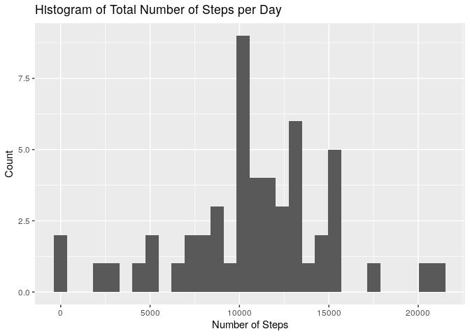
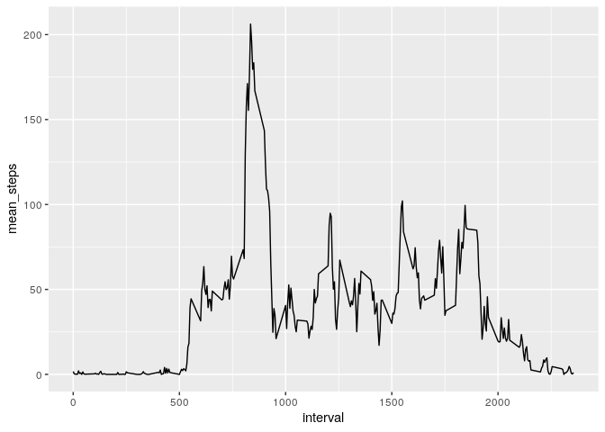
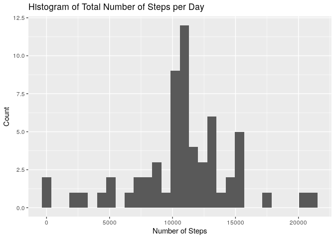
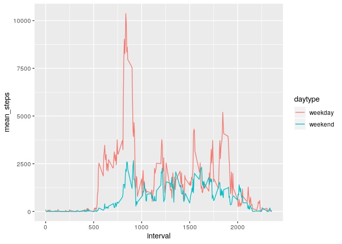

# Introduction

The [data from this assignment](https://d396qusza40orc.cloudfront.net/repdata%2Fdata%2Factivity.zip) comes from an individual's personal activity monitoring device that collects data at 5 minute intervals throughout the day during Octover and November 2012.

# Analysis

First we'll make sure that code written in this RMarkdown file can be seen by reviewers.


```r
library(knitr)
opts_chunk$set(echo=TRUE)
```

## Load Data

First, we'll load and read in the data.


```r
library(tidyverse)

if (!file.exists("data.zip")){
    download.file("https://d396qusza40orc.cloudfront.net/repdata%2Fdata%2Factivity.zip", "data.zip")
}  
if (!file.exists("activity.csv")) { 
    unzip("data.zip") 
}

activity <- read.csv("activity.csv")
```

## What is the mean total number of steps taken per day?

The first analysis we'll do is to calculate the total number of steps taken per day and display this in a histogram.


```r
total_steps <- activity %>%
    drop_na(steps) %>%
    group_by(date) %>%
    summarise(total_num_steps = sum(steps), mean_num_steps = mean(steps))

ggplot(total_steps) + 
    geom_histogram(aes(total_num_steps)) + 
    labs(title="Histogram of Total Number of Steps per Day", x="Number of Steps", y="Count")
```

```
## `stat_bin()` using `bins = 30`. Pick better value with `binwidth`.
```

<!-- -->

The mean and median of total number of steps taken per day are displayed below.


```r
total_steps %>%
    summarise(mean=mean(total_num_steps), median=median(total_num_steps))
```

```
## # A tibble: 1 x 2
##     mean median
##    <dbl>  <int>
## 1 10766.  10765
```

## What is the average daily activity pattern?

Next, we'll make a time series plot of the average number of steps taken at each 5-minute interval, averaged across all days.


```r
interval_mean_step_num <- activity %>%
    drop_na(steps) %>%
    group_by(interval) %>%
    summarise(mean_steps = mean(steps))

ggplot(interval_mean_step_num) +
    geom_line(aes(x=interval, y=mean_steps))
```

<!-- -->

There is a noticeable peak in this plot. At which 5-minute interval did this peak occur?


```r
interval_mean_step_num %>%
    filter(mean_steps == max(mean_steps))
```

```
## # A tibble: 1 x 2
##   interval mean_steps
##      <int>      <dbl>
## 1      835       206.
```

The maximum number of steps occurs at the 835th interval.

## Imputing missing values

The dataset contains a considerable number of missing values. How many rows contain NA?


```r
num_rows_w_NA <- sum(!complete.cases(activity))
```

There are 2304 rows with NA.

The next step is to impute missing values. My strategy was to replace each NA with the mean for that 5-minute interval. 


```r
activity_impute <- activity %>%
    left_join(interval_mean_step_num, by="interval") %>%
    mutate(steps = coalesce(as.double(steps), mean_steps)) %>%
    select(-mean_steps)
```

A histogram was created based on the new dataset with imputed values.


```r
total_steps_impute <- activity_impute %>%
    group_by(date) %>%
    summarise(total_num_steps = sum(steps))

ggplot(total_steps_impute) + 
    geom_histogram(aes(total_num_steps)) + 
    labs(title="Histogram of Total Number of Steps per Day", x="Number of Steps", y="Count")
```

```
## `stat_bin()` using `bins = 30`. Pick better value with `binwidth`.
```

<!-- -->

The mean and median of the imputed dataset was calculated and compared to the non-imputed dataset.


```r
total_steps_impute %>%
    summarise(mean=mean(total_num_steps), median=median(total_num_steps))
```

```
## # A tibble: 1 x 2
##     mean median
##    <dbl>  <dbl>
## 1 10766. 10766.
```

While the mean stayed the same, the median increased slightly.

# Are there differences in activity patterns between weekdays and weekends?

To analyze the differences between weekday and weekend activity patterns, the `weekdays()` function was used to take the date column and transform it into a factor column with "weekday" and "weekend" as levels.


```r
daytype_steps <- activity_impute %>%
    mutate(daytype = factor(weekdays(as.Date(activity$date)) %in% c("Saturday", "Sunday"), labels=c("weekday", "weekend"))) %>%
    group_by(interval, daytype) %>%
    summarise(mean_steps = sum(steps))

ggplot(daytype_steps) +
    geom_line(aes(x=interval, y=mean_steps, group=daytype, col=daytype))
```

<!-- -->

```r
activity_impute %>% filter(is.na(steps))
```

```
## [1] steps    date     interval
## <0 rows> (or 0-length row.names)
```

Clearly, activity levels are higher during the weekday than during the weekend.

